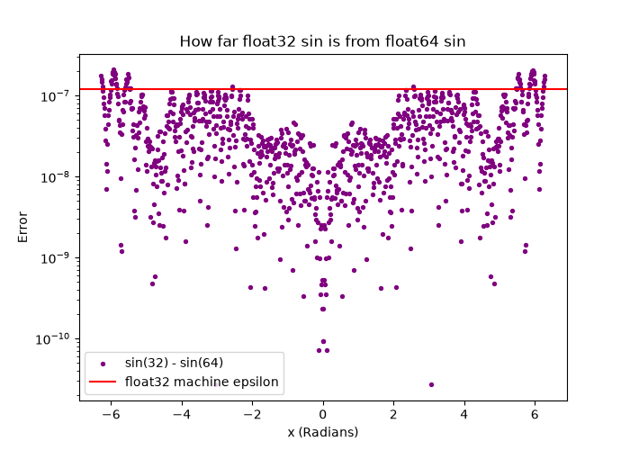

# First Light Project


## NumPy vs. PyTorch Precision

### Results

Output of `python plots.py`:

```
float 32 | allclose: False | max difference: 4.76837158203125e-07
float 64 | allclose: True | max difference: 1.7763568394002505e-15
```

| dtype   | allclose | max difference |
|---------|----------|----------------|
| float32 | False    | 4.77e-07       |
| float64 | True     | 1.78e-15       |

### Why float32 fails and float64 passes

float64 passes because its rounding error (10⁻¹⁵) is far below allclose’s tolerance. float32 fails because its rounding error (~10⁻⁷) is larger than allclose’s default absolute tolerance (10⁻⁸), which is too strict for float32.

### Precision plot



The plot shows how far float32 `sin(x)` is from float64 `sin(x)` at each point, on a log scale. The error is smallest near x = 0 and biggest out at the edges, near ±2π, where it pokes above float32 machine epsilon.

Most of the error comes from storing x itself in float32, not from `sin`. float32 keeps about 7 significant digits, so the rounding error in x grows with |x|: tiny near 0, largest near ±2π. 


## Shared Memory vs. Copies

| function              | before   | after |
|-----------------------|----------|-------|
| torch.from_numpy()    | 98       | 500   |
| torch.tensor()        | 98       | 98    | 

When turning a NumPy array into a tensor using the from_numpy function, it puts the new tensor in the same memory as the original NumPy array. When you create a new tensor using the torch.tensor function, it now is independent and has its own location in memory.

Use the from_numpy() when the data is large and you won’t modify the original, because it avoids a copy.
Use the torch.tensor() when the original might change and you need your own independent version.